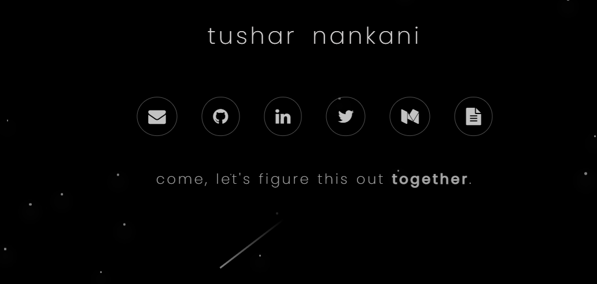

<!--  -->

<h1 align="center">  </h1>
 

 
Know more

 
<!--  <h1 align="center">Welcome to my GitHub! 🤗</h1> -->

<!-- 

 

 -->
<!-- 
  

-   🤗 Read my latest Medium Blog Post - [An Exhaustive WhatsApp Chat Data Analysis.](https://medium.com/@tusharnankani/an-exhaustive-whatsapp-chat-data-analysis-f8421a845c30)
-   🔭 I'm currently working on my Competitive Coding Skills.
-   🌱 I'm currently learning _React.js_ and how to flex my profile's [README.md](https://github.com/tusharnankani/tusharnankani/blob/master/README.md) 💪.
-   👯 I'm looking to collaborate on Open Sourced Projects on _Web Devlopment_ and _Python_ 🐍 related Projects.
-   💬 Ask me about anything, anytime.
-   📫 How to reach me: 
    - [LinkedIn](https://www.linkedin.com/in/tusharnankani/)
    - [Twitter](https://twitter.com/tusharnankanii)
    - <a href="mailto:tusharnankani3@gmail.com">Email</a> -->

### About Me
 
 
Aim is to become a globally competent individual with programming skills along with business leadership/entrepreneurship skills and a desire to contribute to environment and society.

 
- Skilled in C++, Python and JavaScript. Versed with C and Java.
- Comfortable working with ReactJS, NextJS, Sass, Django, Material UI, Firebase, Django, NodeJS (Express.js) PHP, MySQL.
- Documentation Tools/Frameworks: Markdown, Jekyll, MDX, AsciiDoctor.
- Currently enjoying competitive programming and problem solving.
- Keen interest in Data Science, Empirical Research, Statistics, and Machine Learning. 
- Well-versed with Git, GitHub, Figma and Adobe XD.

<!-- I have the **attitude** of a learner, the **courage** of an entrepreneur and the **thinking** of an optimist, engraved inside me. I wish to be a leader in my community of people and have an *innate desire* to contribute to **environment** and **society**. -->

<!-- 
 
 -->

<!-- 
 -->

<!--  -->

<!--  -->

<!-- 
 -->

<!--
 -->

<!---->

 

### Connect with me

|  |  |  |  |  |  |
| :-------------------------------------------------------------------------------------------------------------------------------------------------------------------: | :--------------------------------------------------------------------------------------------------------------------: | :----------------------------------------------------------------------------------------------------------------------------------------------------------------------: | :------------------------------------------------------------------------------------------------------------------------: | :-----------------------------------------------------------------------------------------------------------------------------------------------------------------------: | :-----------------------------------------------------------------------------------------------------------------------------------------------------: |

